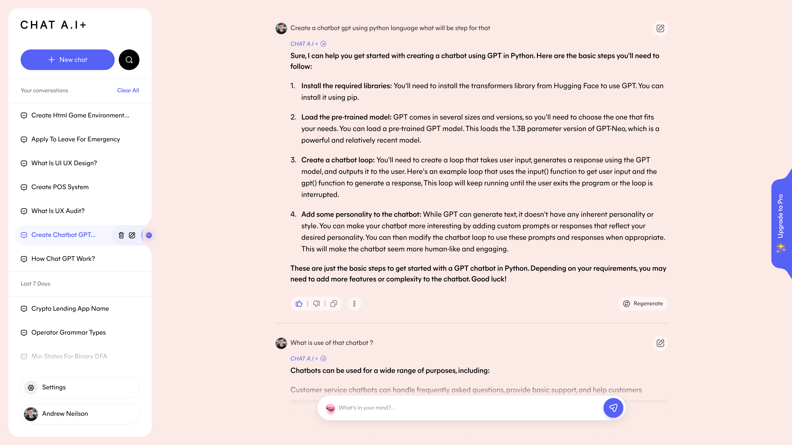
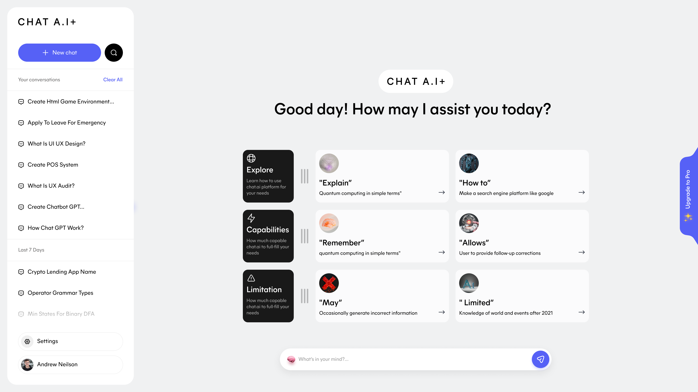
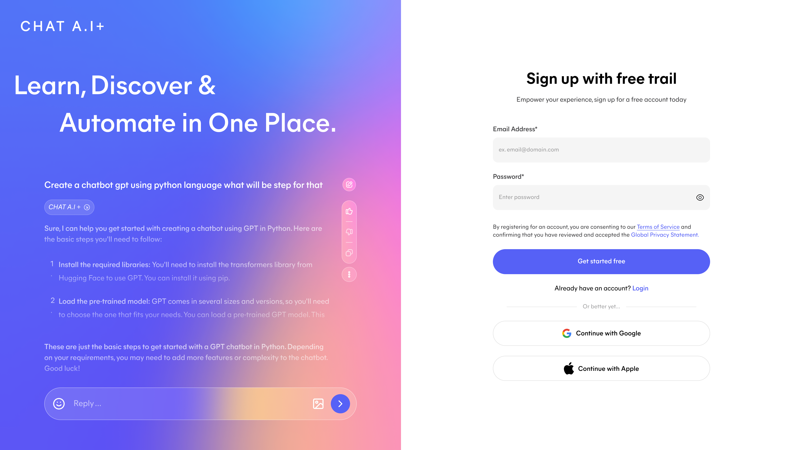
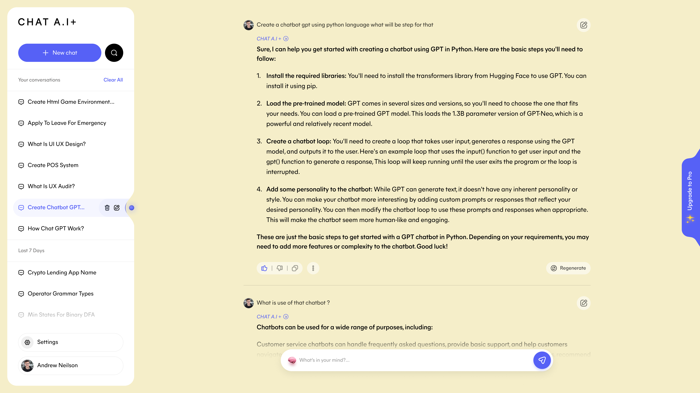

# 💬 Chat AI - AI Chatbot Application

<div align="center">


A modern, ChatGPT-style AI chatbot application built with Next.js, React, and TypeScript.

[Live Demo](#) • [Documentation](DOCUMENTATION.md) • [Quick Start](QUICK_START.md) • [Features](FEATURES.md)

</div>

---

## ✨ Features

- 💬 **Real-time Chat Interface** - Smooth, responsive chat experience
- 🎨 **Modern UI** - ChatGPT-inspired design with dark mode
- 📱 **Responsive Design** - Works on desktop, tablet, and mobile
- 💾 **Chat History** - Persistent storage with date grouping
- 📝 **Markdown Support** - Rich text formatting for messages
- ⚡ **Fast Performance** - Built with Next.js 14 App Router
- 🔐 **Authentication UI** - Sign up page included
- ✨ **Smooth Animations** - Framer Motion animations

## 🚀 Quick Start

### Prerequisites

- Node.js 18 or higher
- npm or yarn package manager

### Installation

```bash
# Clone the repository
git clone https://github.com/yourusername/chat-ai.git

# Navigate to the project
cd chat-ai

# Install dependencies
npm install

# Start development server
npm run dev
```

Open [http://localhost:3000](http://localhost:3000) to see your app!

## 📚 Documentation

- **[QUICK_START.md](QUICK_START.md)** - Get started quickly
- **[DOCUMENTATION.md](DOCUMENTATION.md)** - Complete technical docs
- **[FEATURES.md](FEATURES.md)** - Features checklist & roadmap
- **[DEPLOYMENT.md](DEPLOYMENT.md)** - Deployment guide
- **[PROJECT_SUMMARY.md](PROJECT_SUMMARY.md)** - Project overview

## 🛠 Tech Stack

| Category | Technology |
|----------|------------|
| **Framework** | Next.js 14 (App Router) |
| **Language** | TypeScript |
| **Styling** | Tailwind CSS |
| **UI Components** | Custom React components |
| **Icons** | Lucide React |
| **Markdown** | React Markdown |
| **Animations** | Framer Motion |

## 📁 Project Structure

```
FocusPlan/
├── src/
│   ├── app/              # Next.js pages
│   │   ├── layout.tsx    # Root layout
│   │   ├── page.tsx      # Main chat page
│   │   └── signup/       # Sign up page
│   ├── components/       # React components
│   │   ├── ChatInterface.tsx
│   │   ├── ChatArea.tsx
│   │   ├── Sidebar.tsx
│   │   └── MessageBubble.tsx
│   ├── lib/              # Utility functions
│   └── types/            # TypeScript types
├── public/               # Static assets
├── design/              # Figma design files
└── package.json         # Dependencies
```

## 🎨 Screenshots

<table>
  <tr>
    <td></td>
    <td></td>
  </tr>
  <tr>
    <td></td>
    <td></td>
  </tr>
</table>

## 🎯 Current Features

✅ Multiple chat sessions  
✅ Chat history with localStorage  
✅ Responsive sidebar  
✅ Message input & display  
✅ Markdown formatting  
✅ Dark mode interface  
✅ Mobile-friendly design  
✅ Date-grouped history  
✅ Chat deletion  
✅ Welcome screen with suggestions  

## 🚧 Coming Soon

- [ ] Real AI integration (OpenAI/Anthropic)
- [ ] User authentication
- [ ] Database integration
- [ ] Chat sharing
- [ ] Export functionality
- [ ] Voice input
- [ ] Code syntax highlighting

See [FEATURES.md](FEATURES.md) for the complete roadmap.

## 🛠 Development

```bash
# Start development server
npm run dev

# Build for production
npm run build

# Start production server
npm start

# Run linter
npm run lint
```

## 📦 Deployment

Deploy easily to:

- **Vercel** (Recommended) - [Guide](DEPLOYMENT.md#1-vercel-recommended-)
- **Netlify** - [Guide](DEPLOYMENT.md#2-netlify)
- **Railway** - [Guide](DEPLOYMENT.md#3-railway)
- **Docker** - [Guide](DEPLOYMENT.md#4-docker-deployment)

See [DEPLOYMENT.md](DEPLOYMENT.md) for detailed instructions.

## 🤝 Contributing

Contributions are welcome! Please feel free to submit a Pull Request.

1. Fork the repository
2. Create your feature branch (`git checkout -b feature/AmazingFeature`)
3. Commit your changes (`git commit -m 'Add some AmazingFeature'`)
4. Push to the branch (`git push origin feature/AmazingFeature`)
5. Open a Pull Request

## 📄 License

This project is licensed under the MIT License - see the [LICENSE](LICENSE) file for details.

## 🙏 Acknowledgments

- Design inspired by ChatGPT
- Figma design: ChatGPT v4.5 (Community)
- Icons by [Lucide](https://lucide.dev)
- Built with [Next.js](https://nextjs.org)

## 📞 Support

If you have any questions or run into issues:

- Check the [Documentation](DOCUMENTATION.md)
- Review the [Quick Start Guide](QUICK_START.md)
- Open an [Issue](https://github.com/yourusername/chat-ai/issues)

## ⭐ Star History

If you find this project useful, please consider giving it a star!

---

<div align="center">

**Built with ❤️ using Next.js**

[Report Bug](https://github.com/yourusername/chat-ai/issues) • [Request Feature](https://github.com/yourusername/chat-ai/issues)

</div>
